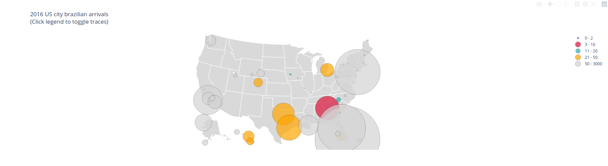

# Come to brazil
### Udacity Data Engineering Capstone Project

#### Project Summary
Brazil is a continentallly sized country, both in terms of geographic size and population. The mercator projection, presented by Flemish geographer and cartographer Gerardus Mercator in 1569 was created long before modern cartographic techniques were developed. South america is larger in size than western europe, and individual brazilian states are larger in both size and population than the largest western european countries, like france and germany. Even as a poor country, the sheer potential in numbers amongst the upper economic echelons of the brazilian population make it a very interesting commercial study subject. That, coupled with a virtual 100% import tariff more than doubling commodity prices natively, and a habit of smuggling goods by both brazilian travelers and brazilian immigrants in america make creating a service industry specifically geared towards catering to brazilian passerbys especially profitable. This study will use airport data from the I94 Immigration Data to determine which airports would be more interesting to establish services such as apple stores accepting brazilian real (brazilian currency) with portuguese speaking salesmen.

The project follows the follow steps:
* Step 1: Scope the Project and Gather Data
* Step 2: Explore and Assess the Data
* Step 3: Define the Data Model
* Step 4: Run ETL to Model the Data
* Step 5: Complete Project Write Up

### Step 1: Scope the Project and Gather Data

#### Scope 

The scope of the project is the data presented by Udacity, presented in graphical form in a plotly graph, but could very well be an auto-updating dash website being fed immigration and travel data from brazil to america. As the joke goes, if you don't come to brazil, brazil comes to you

#### Describe and Gather Data 

- I94 Immigration Data: This data comes from the US National Tourism and Trade Office. A data dictionary is included in the workspace. This is where the data comes from.  
- I94_SAS_Labels_descriptions.SAS - Partial description of the SAS data provided by udacity
- Airport Code Table(airport-codes_csv.csv): This is a simple table of airport codes and corresponding cities. It comes from here.
- U.S. City Demographic Data: This data comes from OpenSoft. You can read more about it here (us-cities-demographics.csv): list of us cities including their latitude and longitude

### Step 2: Explore and Assess the Data
#### Explore the Data 
The presented data was relatively good, well cleaned, but had quite a few entire city names listed as i94 ports, which required some manual cleaning of the data

#### Cleaning Steps
Altered all city airport codes for specific airport codes before inner joining with airport codes dataset

### Step 3: Define the Data Model
#### 3.1 Conceptual Data Model
The data model is an inner join between a filtered dataset of arrivals, by the code assigned to brazil (689), and the airport codes through the iana airport code, and grouped by and counted by individual rows of arrivals, reduced to the count of arrivals, municipality, latitute and longitude, displayed in a geographic map of the united states through a bubble graph using plotly graph objects.

#### 3.2 Mapping Out Data Pipelines
The data is mapped utilizing spark and could be fed from redshift to a dash webpage live, meaning the data could be increased 100x, the pipelines could be run on a daily basis by 7 am every day (or ran every second), and the database could be accessed in redshift by 100+ people.

### Step 4: Run Pipelines to Model the Data 
#### 4.1 Create the data model
Build the data pipelines to create the data model.

#### 4.2 Data Quality Checks
Explain the data quality checks you'll perform to ensure the pipeline ran as expected. These could include:
 * Integrity constraints on the relational database (e.g., unique key, data type, etc.)
 * Unit tests for the scripts to ensure they are doing the right thing
 * Source/Count checks to ensure completeness
 
Run Quality Checks

#### 4.3 Data dictionary 
Create a data dictionary for your data model. For each field, provide a brief description of what the data is and where it came from. You can include the data dictionary in the notebook or in a separate file.

#### Step 5: Complete Project Write Up
* Clearly state the rationale for the choice of tools and technologies for the project.
* Propose how often the data should be updated and why.
* Write a description of how you would approach the problem differently under the following scenarios:
 * The data was increased by 100x.
 * The data populates a dashboard that must be updated on a daily basis by 7am every day.
 * The database needed to be accessed by 100+ people.